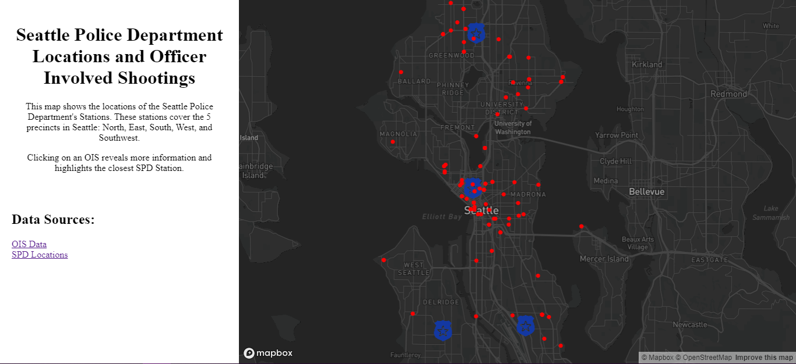
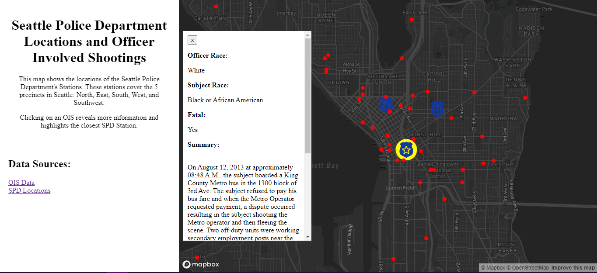
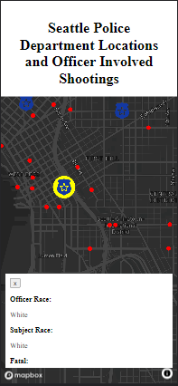

# Seattle Police Department's Officer Involved Shooting Locations
#### Group BA7
## Abstract
This interactive web map is aimed at showing the locations of Officer Involved Shootings (OIS) for the Seattle Police Department (SPD) since 2005 with a descriptive summary of what occurred at that location. Along with the locations of the shootings, which are red dots, the locations of SPD police stations are also indicated on the map by the icon:

## Goal
True Crime has become America’s most recent obsession.  With countless books and television shows drawing in millions of viewers just to recount events that happened in the world.  This project for many reasons has taken that similar form.  With hate crimes being a big headline in recent years, this project wanted to look at more than just typical crime data that gets reported.  OIS’s and the degree of force that officers use when interacting with the community varies depending on many factors such as time of day, area of the incident, and most controversially: race.  OIS’s are never a desired outcome but in the heat of the moment may seem like the right course of action.  Through this interactive web map, we aim to let the viewer decide if the force used was justified or excessive.  When you click on a red dot a summary of the incident appears that is found in the police report.  At the very least, this project is interesting to engage with to see and analyze clusters or examine areas of interest to you.
## Website
The website can be accessed by clicking [HERE!](https://saffolder.github.io/SPD_OIS_locations/)
## Screenshots
### Home Screen

### OIS Description

### Mobile View

## Main Functions
There are a handful of main functions to highlight in this interactive web map.
### Turf.js
Turf.js is a JavaScript library for spatial analysis and statistics on web maps.  It takes advantage of commonly used GIS tools (buffer, union, merge) and statistical functions as well (sum, median, and average).  In this web application we used Turf.js to determine which SPD station was the closest to the location of the shooting.  Interestingly with how police zoning works, there are instances where the nearest SPD station is the station for another beat (the area that police patrol).  This means that although the incident may have occurred near station A, the officer involved is from station B.
### Updating Popup
Using different event listeners for hovering over a location versus clicking on a location, you are provided with different information.  For example, if you hover over a blue badge icon, a popup will tell you the name of that police station until you remove your mouse from above it.  Similarly with the OIS locations, hovering over an OIS location will confirm that it is an OIS location.  When you click on an OIS location however, a larger popup appears on the side of the screen with information regarding that OIS.  Information included is the officer involved race, the subject’s race, whether the incident resulted in a fatality, and a summary of the incident.  The summary tends to be length and so the popup includes the ability for the user to scroll through the text to read the full description.
### Mobile Compatibility
In the ever-increasing population of billions of mobile devices around the world, we thought that it would be important for our application to be compatible with mobile devices.  There are challenges to this however, with limited screen size and processing capabilities compared to a desktop, we had to make different design decisions.  First, when experiencing the application on a mobile device the only initial text that remains is the title and it moves to the top of the page.  Further, when a mobile user clicks on an OIS location, the information populates on the bottom of the screen for them instead of the side.  Seattle is a unique city in the fact that it is tall and skinny whereas most cities are very radial.  This presents unique challenges and opportunities for how to display it on the web, specifically what level of zoom to use since a farther out zoom shows a large amount of water in the map.

## Data
### OIS Data
The [data for the OIS](https://data.seattle.gov/Public-Safety/SPD-Officer-Involved-Shooting-OIS-Data/mg5r-efcm) is from Seattle Open Data portal, while this data has longitude and latitude variables, it was not readily available in GeoJSON format which we use for our web mapping.  This required putting the .csv (Comma Separated Values) file through an online converter into JSON, it was from there that we wrote our own JavaScript file to read in this JSON and put it in an appropriate GeoJSON format for us to use in our mapping.  In the GitHub repository we include JSON data and our cleaned GeoJSON data.
### SPD Station Location Data
The [data for SPD station's](https://www.seattle.gov/police/about-us/police-locations) locations came from Seattle’s Government website.  This data was also not in a GeoJSON format so using Google Maps to get longitude and latitude coordinates we were able to put each location into a mappable format.
## Libraries and Web Services
### Turf.js
Already discussed was the [Turf.js library](https://docs.mapbox.com/help/tutorials/analysis-with-turf/ ) and how it was used for spatial analysis in this web map.
### Mapbox
The web map is built from [Mapbox GL JS](https://docs.mapbox.com/mapbox-gl-js/guides/) which is a client-side JavaScript library for building web maps and applications.  Mapbox provides great customizability and user interactivity.  It is so customizable that we were able to create our own unique basemap for this project!
### Git and GitHub
Finally, this project was done collaboratively using Git with the project being hosted by GitHub on their servers.
## Acknowledgement
We would like to thank Professor Zhao and Steven Bao for their commitment to each of our learning and understanding this quarter and the Geography Department at the University of Washington for offering this course in web mapping.